# RP Top Physical Design Project

## Overview

RP Top is an ASIC Physical Design project implemented using Synopsys Design Compiler (DC) and IC Compiler II (ICC2). The project covers the complete Physical Design flow from synthesis handoff through routing and filler insertion.

## Tools Used

- Design Compiler (DC)
- IC Compiler II (ICC2)

## Physical Design Flow

### 1. Synthesis
- Synthesized RTL using Design Compiler
- Generated gate-level netlist
- Applied timing constraints

### 2. Floorplanning
- Core area planning
- Pin planning
- Macro placement preparation

### 3. Pin Placement
- Created pin guides
- Performed pin placement
- Configured routing directions

### 4. Boundary and Tap Cell Insertion
- Inserted boundary cells
- Inserted tap cells
- Verified legality

### 5. Power Planning
- Power and ground connectivity setup
- PG verification checks

### 6. Placement
- Standard cell placement
- Port buffer insertion
- Placement optimization
- Congestion management

### 7. Spare Cell Insertion
- Added spare cells for ECO support
- Legalized placement

### 8. Clock Tree Synthesis (CTS)
- Clock tree construction
- Clock skew optimization
- Clock latency optimization

### 9. Routing
- Global routing
- Detailed routing
- SI-aware routing optimization
- Redundant via insertion

### 10. Verification
- Routing checks
- LVS checks
- Legality verification

### 11. Filler Insertion
- Filler cell insertion
- Final physical connectivity checks

## Skills Demonstrated

- ASIC Physical Design Flow
- Floorplanning
- Pin Planning
- Placement Optimization
- Clock Tree Synthesis (CTS)
- Routing
- Filler Insertion
- TCL Scripting
- ICC2

## Key Learnings

- End-to-end Physical Design implementation flow
- Power planning methodology
- CTS optimization techniques
- Routing and verification flow
- Physical Design scripting using TCL

## Project Screenshots

  ### Library Setup
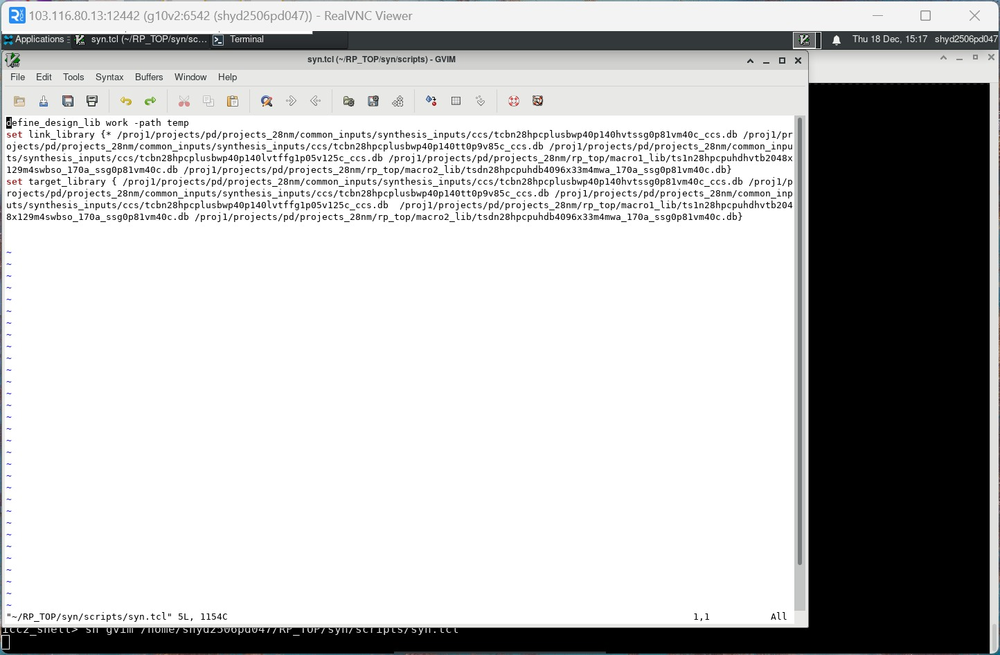

  ### SDC Constraints
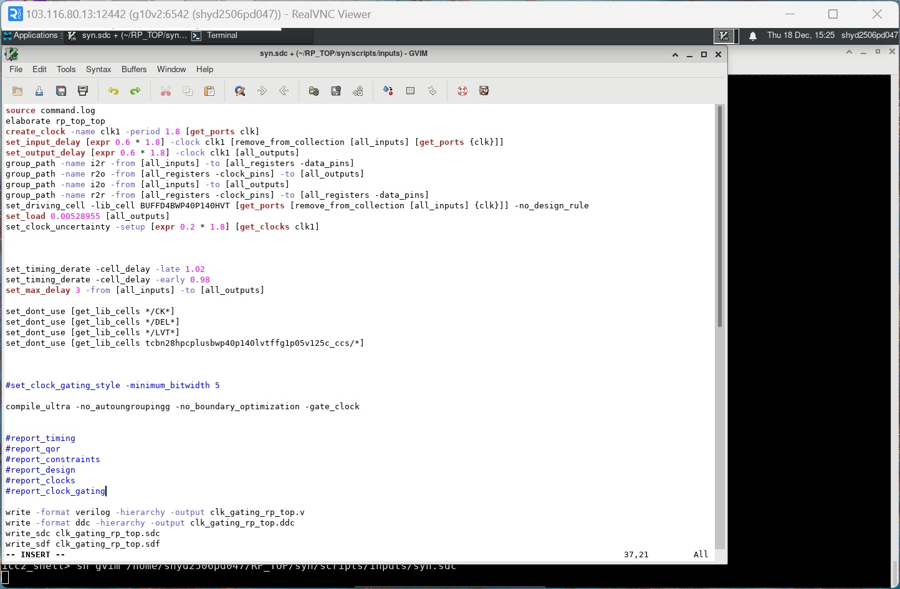

  ### MMMC Setup
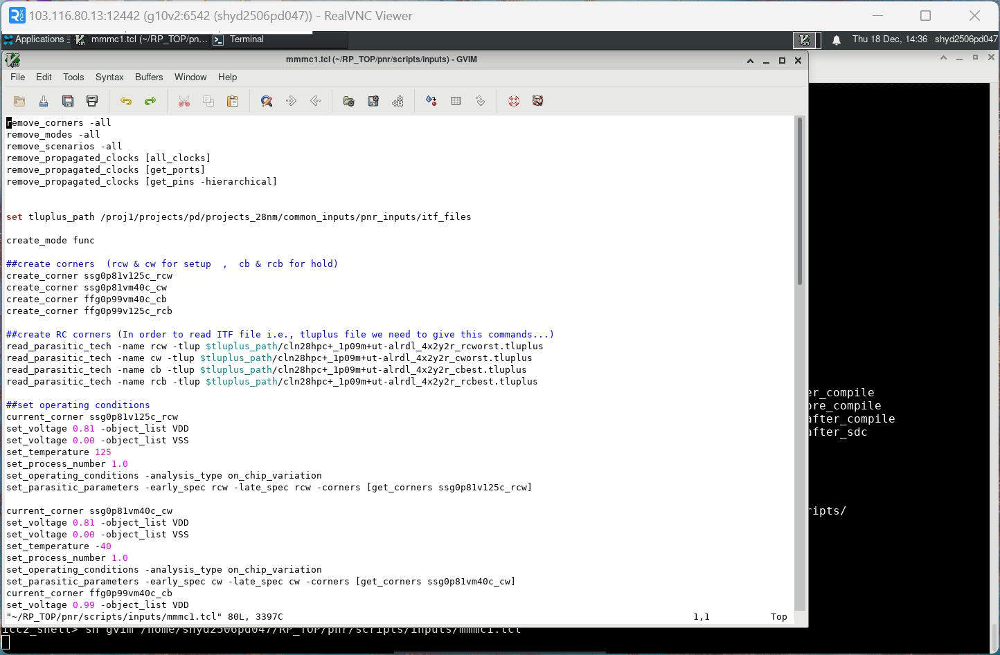

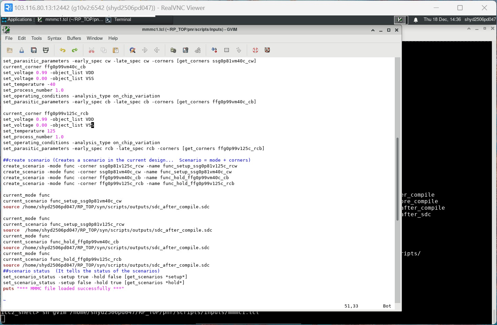

  ### Clock Uncertainty
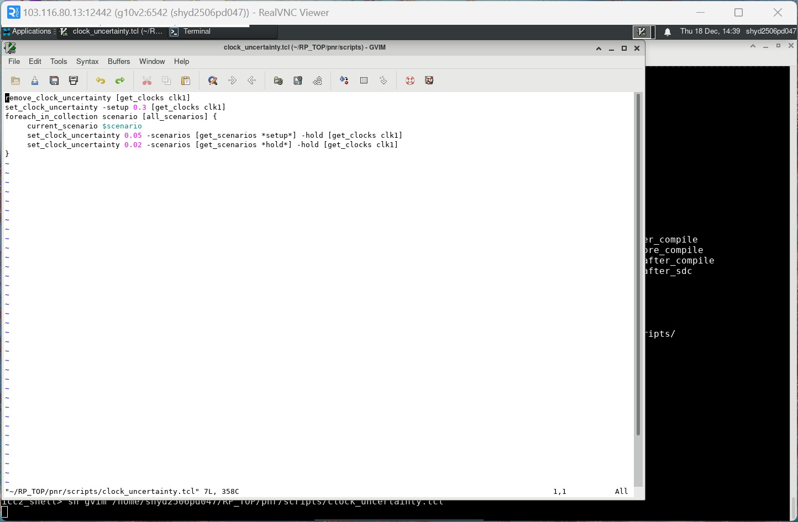

  ### Floorplanning
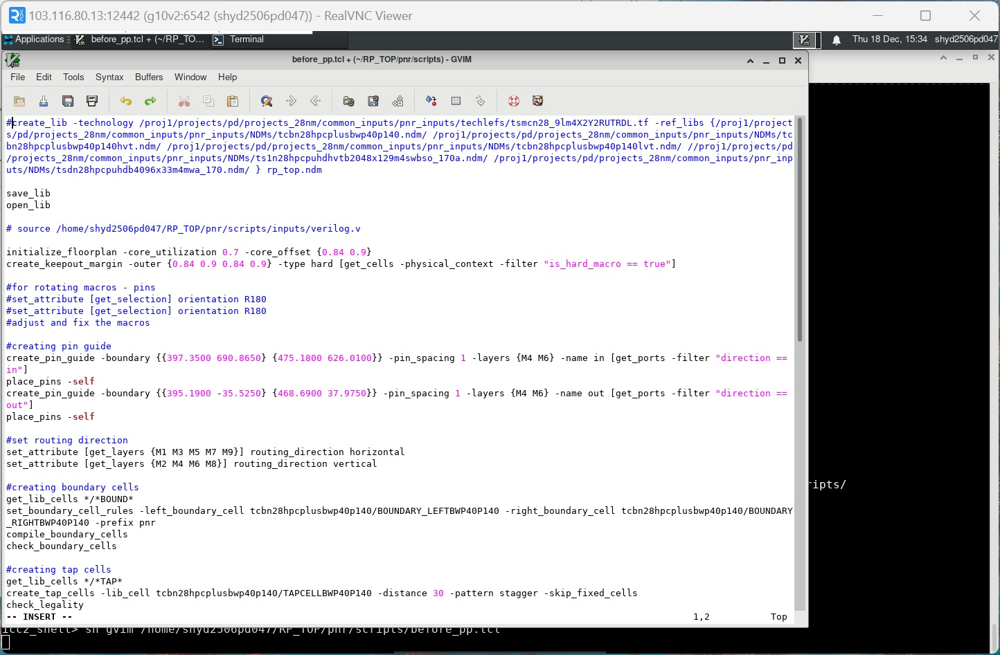

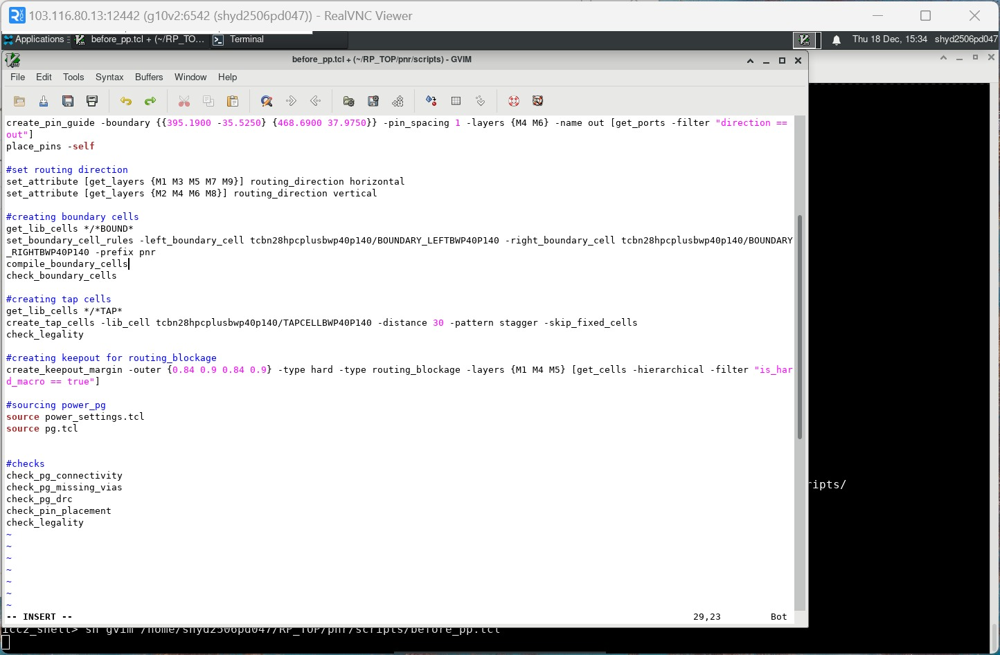

  ### Power Planning
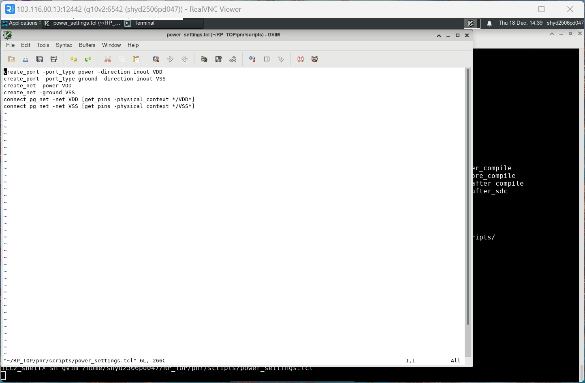

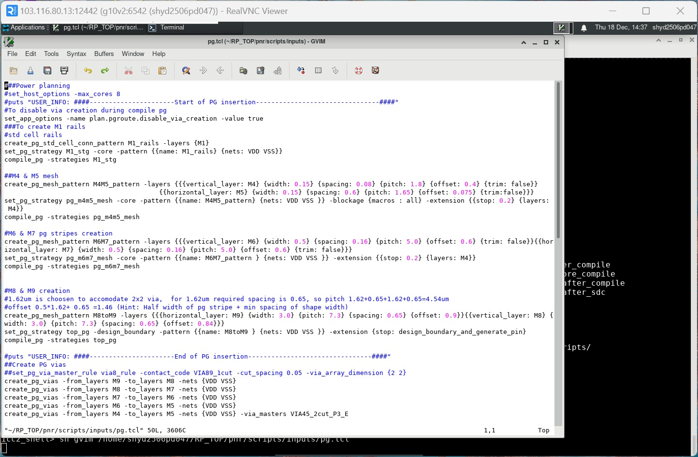

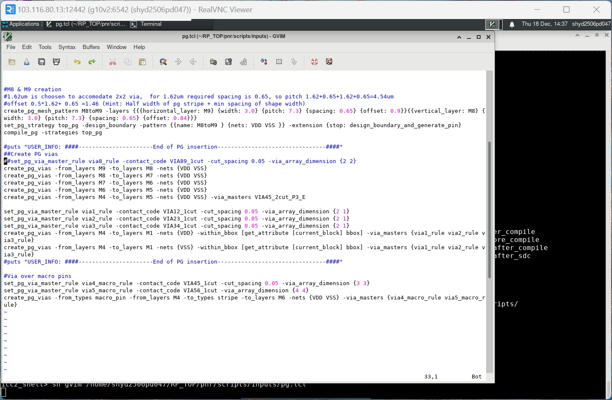

  ### Placement
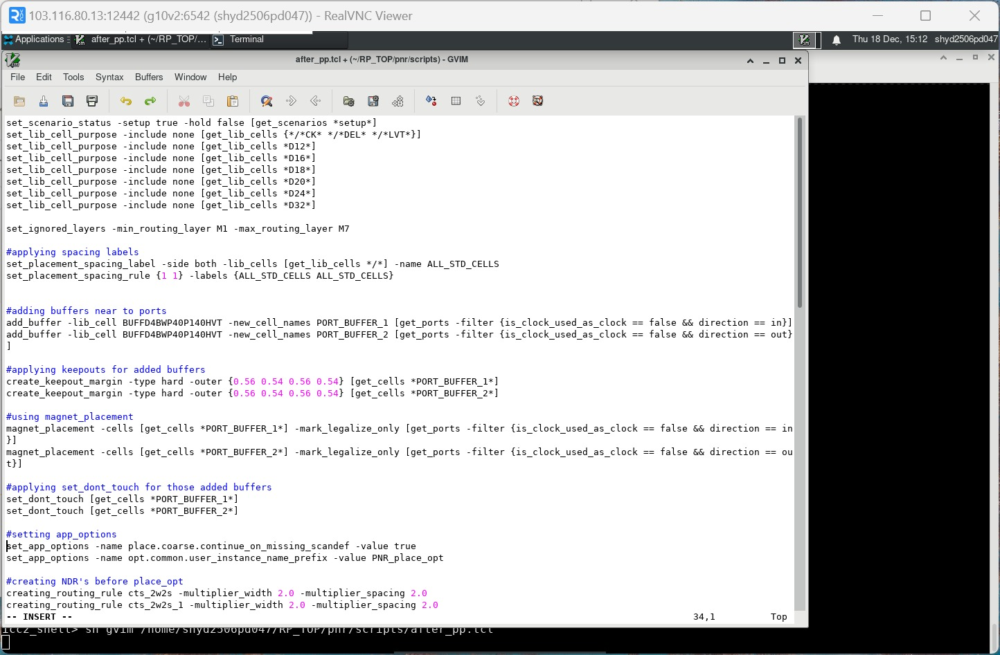

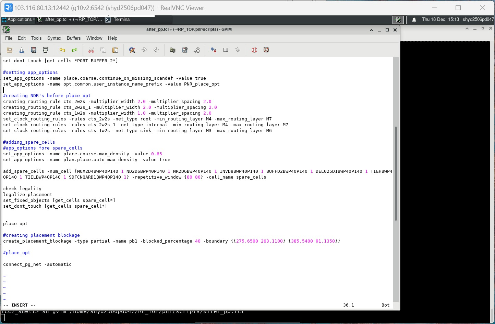

  ### Clock Tree Synthesis (CTS)
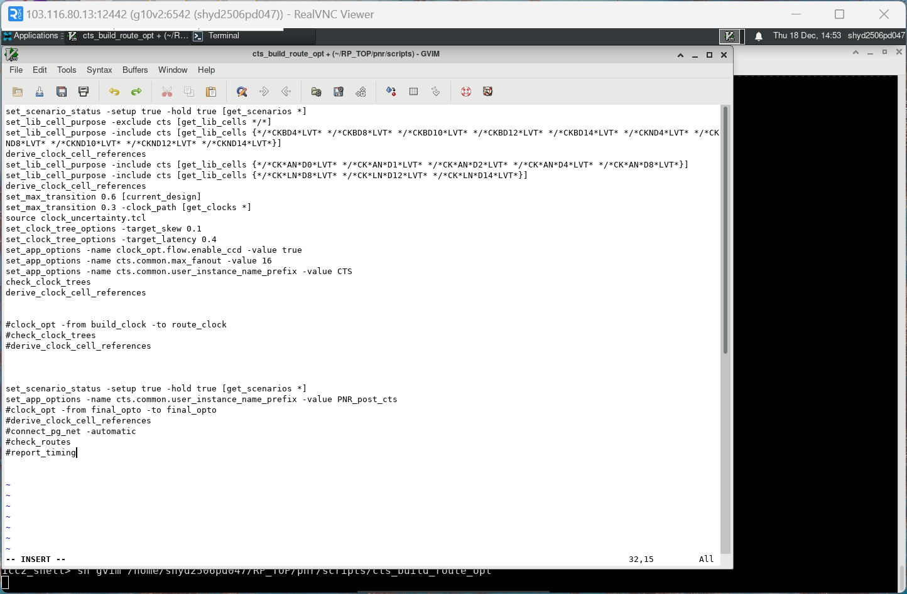

   ### Routing
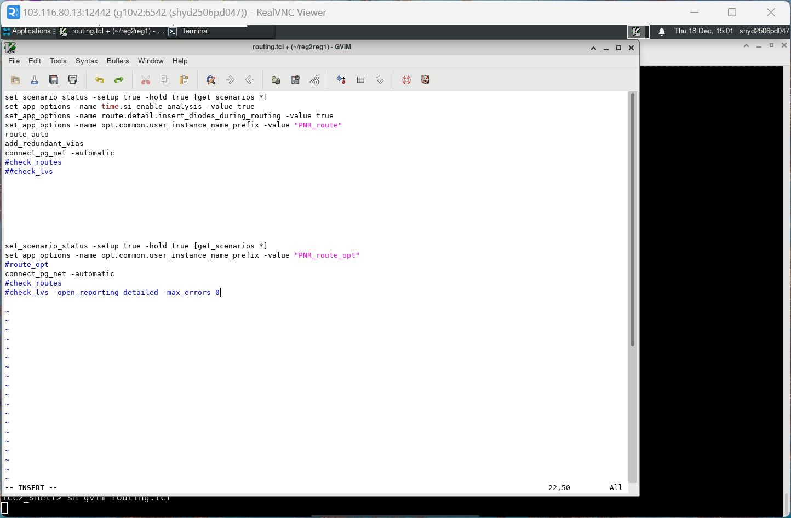
